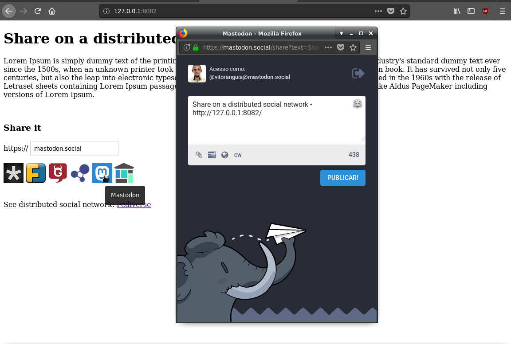

# Sise

> Share on a dIstributed Social nEtwork

This is a simple plugin JavaScript plugin, similar to ``AddThis`` and ``ShareThis`` plugins for distributed social networks.

This package is compatible with [StandardJS](https://standardjs.com/) and [LibreJS](https://www.gnu.org/software/librejs).



Support

- diaspora\*
- Friendica
- GNU Social
- Hubzilla
- Mastodon
- Socialhome

## Usage

Use this example

``` html
<!doctype html>
<html lang="en">
  <head>
    <meta charset="utf-8">
    <title>Title</title>
  </head>
  <body>
    <!-- CDN -->
    <script src="https://unpkg.com/@sepbit/sise/src/sise.js"></script>
  </body>
</html>
```

## Contributing

I am not good with design, if you can make it beautiful, fork and let me know and the link to your repository will be here.

Pull Requests not accepted.

## Security

If you discover any security related issues, please email `contato@sepbit.com` instead of using the issue tracker.

## License

GPL-3.0-or-later, please see [COPYING](COPYING) file for more information.
